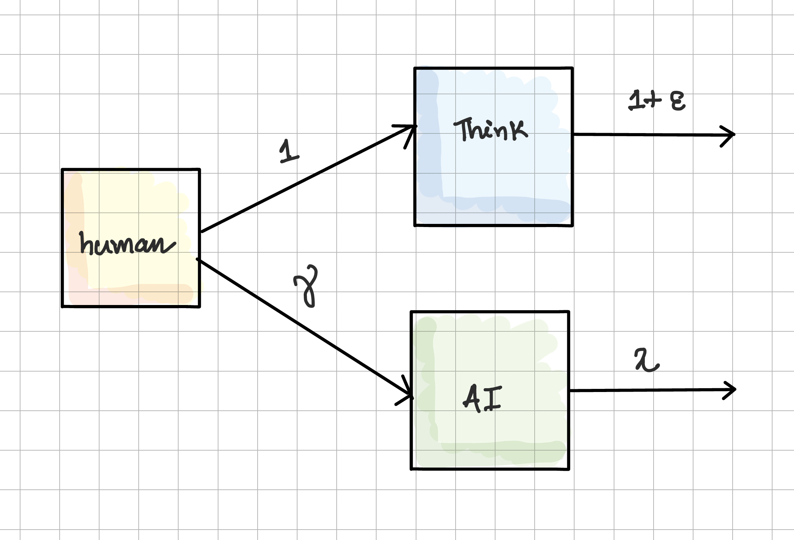
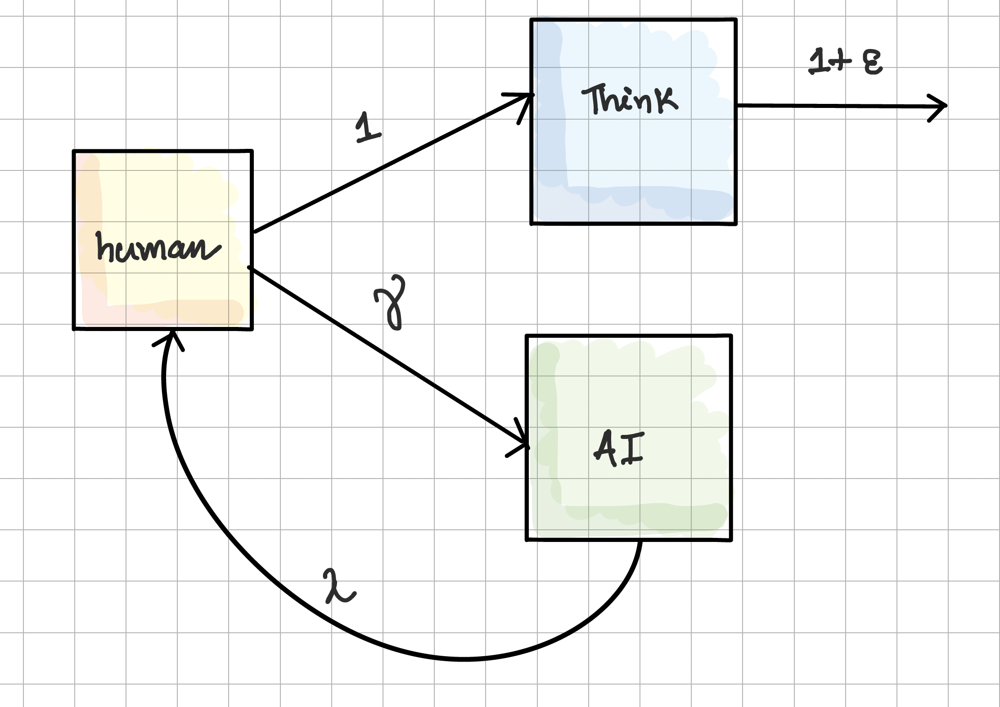
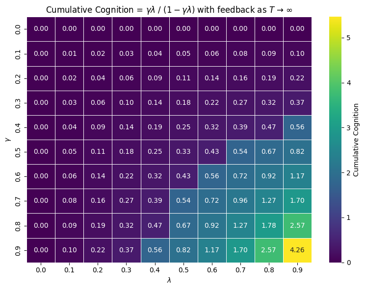
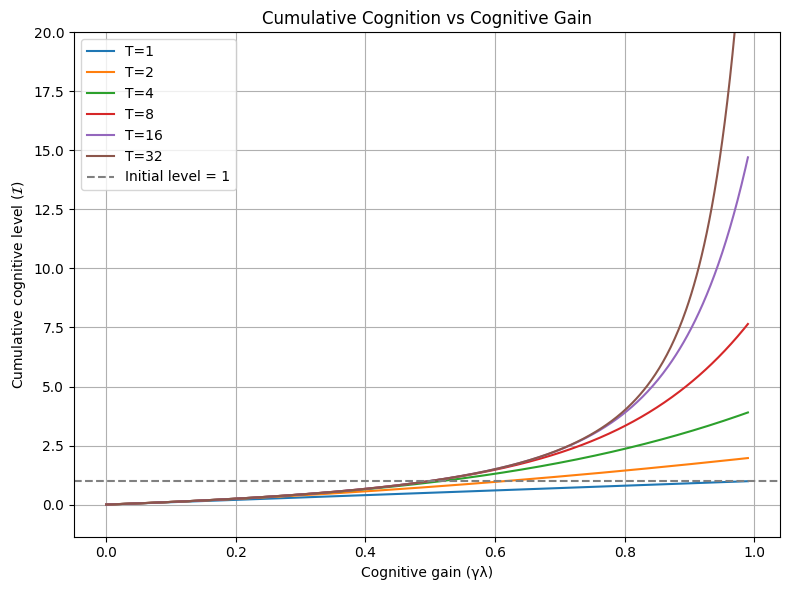

<link rel="stylesheet" href="/assets/theme.css">

<link rel="icon" href="/assets/favicon.png" type="image/png">

# Using AI won't make you dumb: less interaction might

Nowadays, Large Language Models like ChatGPT, DeepSeek, Gemini, Perplexity, Claude, etc., are the flagbearers of Artificial Intelligence, and people query these models now and then to get answers. However, there are some studies[^2] [^3] [^4] [^5] that show using AI might be reducing a person’s intelligence. One of my friends even came up to me and said, "Have you checked this paper by MIT[^2] that shows signs of reduced brain functioning among ChatGPT users?" 

At first, it wasn’t really surprising, but after a moment, I thought—well, I’ve seen people get smarter, and I personally use it to augment my daily tasks. And honestly, even if not a lot, I feel there's at least a $\delta$ addition to my knowledge base from using these tools, and I find it contradicts the study conducted by MIT. 

So I felt even though there's a negative correlation between GPT users/abusers and their intelligence, there might be a confounding factor at play. And right now, as per my current understanding of concepts, I think this confounding factor is **Interaction**.

Now I am going to present my take on this, and since I study Reinforcement Learning, I am going to model this problem using a *Markov Decision Process* (MDP). I’ll cite Lilian Weng's blog[^1] if anyone's interested in getting some fundamentals on Reinforcement Learning. But this blog is not loaded heavily with RL stuff, so I think this is going to be an easy read. Also, I am open to suggestions, so feel free to reach out and point out errors or maybe collaborate on interesting topics.

---

## What happens when you don't think and just rely on ChatGPT?

I have used my iPad to draw out these diagrams and I hope they're readable. 

So, what is this block diagram? There is a person (a human) who is tasked with solving a problem.  
- Now, the person has the choice of either **Thinking** it out—entirely relying on their cognition to output a solution—or relying on **AI** tools like ChatGPT.  
- If the person opts to think, they need to use the full fraction or the whole ($1$) of their cognition, and due to this, their intelligence increases by $\epsilon$.  
- Whereas if a person opts for ChatGPT-like tools, they are only using a $\gamma$ fraction of their cognition, and their intelligence further gets reduced by a fraction of $\lambda$, resulting in a net cognitive contribution of $\gamma\lambda$.

> **Note**:  
> - Initially, the cognition level is set to 1  
> - $\epsilon$ represents the reward for engaging one's cognition. It reflects the intrinsic benefit of thinking—even if the outcome isn't correct, the process itself contributes to growth.  
> - $\gamma$ is the user's reluctance to use AI. A high $\gamma$ means low reluctance, i.e., you're freely delegating to AI whereas a low $\gamma$ means you're hesitant, using AI sparingly.
> - $\lambda$ is the "cognitive absorption rate" — the fraction of the AI output that a human actually internalizes. $\lambda$ controls the amount of information absorbed by the brain from the AI output. If $\lambda$ is low, you're barely comprehending with what the AI produces. If it's high, you're deeply processing it.
> - $0 < \epsilon, \gamma, \lambda \leq 1$  

It should be clear by now that if one intends to improve their brain activity, they should **Think**, as relying on **AI** is clearly adversarial. For a simple calculation, we can substitute $\epsilon = 0.05$, $\gamma = 0.5$, and $\lambda = 0.5$ and conclude that:
- Opting to think increases brain activity from 1 to 1.05  
- Opting for an AI tool reduces brain activity from 1 to 0.25  

Therefore, thinking seems to be the optimal move. Or is it?

---

## What happens when you think and interact with ChatGPT?

This model is the same as before, with the only exception that whenever you rely on an AI tool, your cognition reduces by a total of $\gamma\lambda$, but you take this output, internalize it, think, and have the choice to again feed your thoughts and analysis back to the AI tool—thus creating a cycle of interaction and learning.

Question is: what happens then?

Let us assume that we are interacting with the bot for $T$ cycles. Since we internalize the output from the AI tool, it consequently gets added to our cognition pool. Hence,  
- At time step $t=1$, intelligence level $\mathcal{I}_1 = \gamma\lambda$  
- At time step $t=2$, intelligence level $\mathcal{I}_2 = (\gamma\lambda)^2$  
- At time step $t=T$, intelligence level $\mathcal{I}_T = (\gamma\lambda)^T$  

As we have mentioned before, these levels contribute cumulatively to our cognition pool, resulting in the total cognitive level:

$$
\begin{align*}
\mathcal{I} &= \mathcal{I}_1 + \mathcal{I}_2 + \cdots + \mathcal{I}_T \\
&= \gamma\lambda + (\gamma\lambda)^2 + \cdots + (\gamma\lambda)^T \\
&= \gamma\lambda\left(\frac{1 - (\gamma\lambda)^{T}}{1 - \gamma\lambda}\right) \\
& \text{as } T \to \infty \\
\mathcal{I} &= \gamma\lambda\left(\frac{1}{1 - \gamma\lambda}\right)
\end{align*}
$$

Now what? Well, let's look into $\gamma\lambda$ a bit more. If we want our $\mathcal{I} > 1$, then:

$$
\begin{align*}
\mathcal{I} &> 1 \\
\gamma\lambda\left(\frac{1}{1 - \gamma\lambda}\right) &> 1 \\
\gamma\lambda &> 1 - \gamma\lambda \\
\gamma\lambda &> \frac{1}{2}
\end{align*}
$$

If we recall the terms $\gamma$ and $\lambda$ by their definitions, we can see that together both these terms model the **Cognitive Gain from AI**

$$
\boxed{\text{Cognitive Gain from AI} = \gamma \lambda}
$$

## Some Quick Analysis

I jotted down some quick code using Python and here are some interesting results:

So this is actually a contour plot but I used a heatmap for readability. This plot highlights the interaction between $\gamma$ and $\lambda$, which jointly serve as the Cognitive Gain. The color values encode the Cumulative Cognition when interaction tends to infinity. Corresponding to each $\gamma$ and $\lambda$ value, one can see the cognition level at equilibrium.

It’s perfectly rational to follow up with the question: *Should we then keep on interacting till the end of time?* To explore this, I am sharing a second plot:

What's really interesting is the fact that repeating the interaction cycle even twice (for a cognitive gain of 0.62) is sufficient to cross the initial cognitive level of 1 — and this exponentially rises with the number of interaction cycles.

## 🔬 Try it Yourself

Use the mouse to set the slider value corresponding to the number of interaction cycles $T$. Note the cumulative gain against a particular cognitive gain. 

<iframe src="/assets/cognition-interactive.html" width="100%" height="700" style="border:none;"></iframe>

---

## References  
[^1]: [A long peek into Reinforcement Learning](https://lilianweng.github.io/posts/2018-02-19-rl-overview/)

[^2]:[Your Brain on ChatGPT: Accumulation of Cognitive Debt when Using an AI Assistant for Essay Writing Task](https://arxiv.org/abs/2506.08872)

[^3]:[AI Tools in Society: Impacts on Cognitive Offloading and the Future of Critical Thinking](https://www.mdpi.com/2075-4698/15/1/6)

[^4]:[AI as Extraherics: Fostering Higher-order Thinking Skills in Human-AI Interaction](https://arxiv.org/abs/2409.09218)

[^5]:[Impact of artificial intelligence on human loss in decision making, laziness and safety in education](https://www.nature.com/articles/s41599-023-01787-8)
