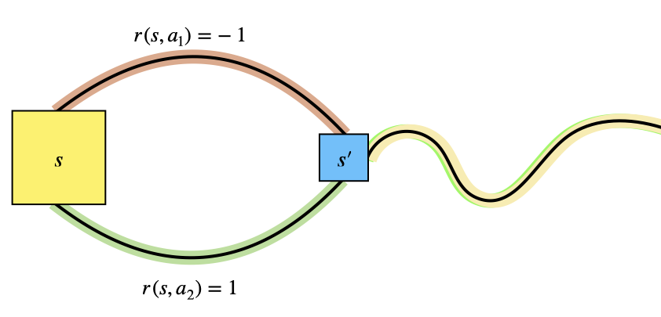

<link rel="stylesheet" href="/assets/theme.css">

<link rel="icon" href="/assets/favicon.png" type="image/png">

# Policy Gradient as Policy Iteration

In this blog, I am going to document another interpretation of Policy Gradient in terms of Policy Iteration. To keep this blog short, I’m skipping a lot of fundamentals and will cite resources for readers to refer to wherever necessary. With that, let's try to look at Policy Gradient from the lens of Policy Iteration.

## Policy Iteration

Let’s say we have a policy $\pi$ which specifies a distribution over actions $A = \{a_1, \cdots, a_k\}$ given a state $s \in S$. In other words,  
$$
\pi(a|s) \in [0, 1], \quad \sum_{a\in A(s)}\pi(a|s) = 1
$$
> Note: $S$ and $A$ are the state and action spaces respectively. $A(s)$ is the set of actions admissible in state $s$.

An RL agent in a particular state $s$ will refer to this policy $\pi$ to pick an action $a \in A(s)$. The goal of RL is to find the best policy that yields the maximum return. And if $\pi$ is already the best policy, then solving the problem is trivial — just act according to $\pi$!

An agent is usually initialized with some random policy $\pi_0$, and at each iteration $t$, we repeat the following steps:
- Evaluate the policy $\pi_t$
- Improve the policy to get $\pi_{t+1} \leftarrow \text{improved}(\pi_t)$

Let’s unpack both steps:

- **Evaluation**: This is essentially the calculation of expected return from following $\pi$. Given an initial state distribution $h(s)$, the value of policy $\pi$ can be evaluated as:
$$
\eta(\pi) = \mathbb{E}_{s \sim h(s)}\left[V_\pi(s)\right]
$$

- **Improvement**: Assuming a finite number of actions and states, we can improve the policy by choosing the action in each state that maximizes the $Q$-value under $\pi$:
$$
\pi'(s) = \arg\max_a Q_\pi(s, a)
$$

Is this guaranteed to improve the policy? Let’s analyze:

$$
\begin{align*}
\eta(\pi') &= \mathbb{E}_{s \sim h(s)}\left[V_{\pi'}(s)\right] \\
&= \mathbb{E}_{s \sim h(s)}\left[\max_a Q_\pi(s, a)\right] \\
&\geq \mathbb{E}_{s \sim h(s)}\left[ \mathbb{E}_{a \sim \pi}\left[Q_\pi(s, a)\right] \right] \\
&= \mathbb{E}_{s \sim h(s)}\left[ V_\pi(s) \right] \\
&= \eta(\pi) \\
&\boxed{\therefore \eta(\pi') \geq \eta(\pi)}
\end{align*}
$$

So policy iteration guarantees improvement over the current policy, as long as the current policy is suboptimal. Once the policy becomes optimal, the improvement step yields the same policy again. This makes intuitive sense: if there exists a better policy, the improvement step will find it; if not, we must already be at the best.

To all my dear skeptic readers, here’s a short proof:

Assume a policy $\pi$ is suboptimal but still satisfies:

$$
\forall s \in S,\quad \pi(s) = \arg\max_a Q_\pi(s, a)
$$

Then by definition of improvement:

$$
\pi'(s) = \arg\max_a Q_\pi(s, a) = \pi(s)
$$

But we also know that the optimal policy $\pi^*$ satisfies:

$$
\forall s \in S, \quad \pi^*(s) = \arg\max_a Q_{\pi^*}(s, a)
$$

This contradicts the assumption that $\pi$ is suboptimal, yet invariant to improvement. Hence, such a $\pi$ must already be the optimal policy, i.e., $\pi = \pi^*$.

So far, we’ve seen:
- Policy iteration consists of two steps: Evaluation and Improvement
- Policy iteration guarantees improvement at every step
- Once optimal, further improvement has no effect

## Policy Gradient

You can check out my blog on [Policy Gradients](policy-gradient.md) to dig into the derivation. One may wonder: *Why do we need another method if we already have a proven one?* That’s actually outside the scope of this blog, since it would require bootstrapping a few more topics — but here’s a rough idea.

The improvement step in Policy Iteration demands a `max` over the set of actions. Now imagine that set is infinite — say, continuous. Take it a step further: the improvement needs to happen for *every* state, and the state space is also infinite. Can you really do policy iteration in practice then?

Let’s say, somehow, you’ve managed to carve out a significant portion of the state-action space and now want to perform policy evaluation. What happens when you encounter a state you’ve never seen before?

To address such issues, function approximation was introduced — and that eventually evolved into deep RL. Policy Gradient is one approach in this space that aims to find the best policy by moving in the direction of the gradient of the expected return. Naturally, a question arises: *Is improvement guaranteed when moving in the direction of the gradient, just like in Policy Iteration?* And the answer is — yes!

The objective in Policy Gradient is formulated as:

$$
\max_\theta \eta(\theta) = \max_\theta \mathbb{E}_{\tau \sim \rho_\theta(\tau)}\left[\sum_{t=0}^\infty \gamma^t r(s_t, a_t)\right]
$$

> Here, $\eta(\theta)$ is a measure of the performance of the policy $\pi_\theta$, which represents the expected discounted return over trajectories $\tau$ sampled from the trajectory distribution $\rho_\theta$.

Following the gradient ascent update rule, we update the parameters as:

$$
\theta' \leftarrow \theta + \alpha \nabla_\theta \eta(\theta)
$$

Policy Gradient shows that maximizing $\eta(\theta')$ is consistent with maximizing the difference $\eta(\theta') - \eta(\theta)$. This turns out to be equivalent to maximizing the expected cumulative discounted **advantage** under the old policy $\pi_\theta$, but for trajectories sampled using the new policy $\pi_{\theta'}$:

$$
\max_{\theta'} \eta(\theta') \equiv \max_{\theta'}\left[\eta(\theta') - \eta(\theta)\right] \equiv \max_{\theta'}\mathbb{E}_{\tau \sim \rho_{\theta'}(\tau)}\left[\sum_{t=0}^\infty \gamma^t A_{\pi_\theta}(s_t, a_t)\right]
$$

Before jumping into the proof, let’s take a moment to build some intuition. Imagine two policies that are identical except for a single state $s$. In $s$, $\pi_1$ takes action $a_1$, while $\pi_2$ takes $a_2$. Both actions lead to the same next state $s'$, but with different rewards: specifically, $r(s, a_1) = -1$ and $r(s, a_2) = 1$. The illustration below helps visualize this setup:

The advantage of taking action $a$ in state $s$ and then following policy $\pi$ is defined as:

$$
\begin{align*}
A_{\pi}(s, a) &= Q_\pi(s, a) - \mathbb{E}_{a \sim \pi}\left[Q_\pi(s, a) \right]\\ 
&= Q_\pi(s, a) - V_\pi(s) \\
&= \mathbb{E}_{s'\sim P(s'|s, a)}\left[r(s, a) + \gamma V_\pi(s')\right] - V_\pi(s) \\
&\approx r(s, a) + \gamma V_\pi(s') - V_\pi(s)
\end{align*}
$$

So for $\pi_1$ and $\pi_2$, we compute the advantages as:

$$
\begin{align*}
A_{\pi_1}(s, \pi_1(s)) &= -1 + \gamma V_{\pi_1}(s') - V_{\pi_1}(s) \\
A_{\pi_1}(s, \pi_2(s)) &= 1 + \gamma V_{\pi_1}(s') - V_{\pi_1}(s)
\end{align*}
$$

Clearly,

$$
\boxed{A_{\pi_1}(s, \pi_2(s)) > A_{\pi_1}(s, \pi_1(s))}
$$

Since $\pi_1$ and $\pi_2$ behave identically everywhere else, we have:

$$
\sum_{t=1}^\infty \mathbb{E}_{s_t, a_t \sim \rho_{\pi_1}} \left[A_{\pi_1}(s_t, a_t)\right] = \sum_{t=1}^\infty \mathbb{E}_{s_t, a_t \sim \rho_{\pi_2}} \left[A_{\pi_1}(s_t, a_t)\right] \quad \text{for } s_t \neq s
$$

But due to the one different action, the total cumulative advantage under $\pi_2$ will be higher:

$$
\boxed{
\sum_{t=1}^\infty \mathbb{E}_{s_t, a_t \sim \rho_{\pi_2}} \left[A_{\pi_1}(s_t, a_t)\right] > \sum_{t=1}^\infty \mathbb{E}_{s_t, a_t \sim \rho_{\pi_1}} \left[A_{\pi_1}(s_t, a_t)\right]
}
$$

Hence, even if the new policy is better than the old one by just a little, we can guarantee an increase in expected cumulative advantage. *(This idea easily extends to the discounted case as well — we’ll get to that.)*

So, does this guarantee hold only when we take the exact $\max$? Or is **any** improvement enough? The answer should be clear by now — improvement is enough. We started exploring Policy Gradient precisely to avoid the need for an exact $\max$ over an infinite state-action space. And if you go back and examine the calculation, you’ll notice: as long as the new policy is even marginally better, the cumulative advantage increases.

To hammer the point home:  
**Better, not best, is sufficient for improvement !**

---

Let the new policy parameters be $\theta'$ obtained by 

$$
\theta ' = \theta + \alpha \nabla_\theta \eta(\theta)
$$

Thus we have 

$$
\begin{align*}
\eta(\theta') - \eta(\theta) &= \eta(\theta') - \textcolor{blue}{\mathbb{E}_{s_0 \sim h(s_0)}\left[V_{\pi_\theta}(s_0)\right]}\\
&=\eta(\theta') - \textcolor{red}{\mathbb{E}_{s_0, a_0, \cdots \sim \rho_{\theta'}(\tau)}\left[V_{\pi_\theta}(s_0)\right]} \quad \text{where }\rho_{\theta'}(\tau) = h(s_0)\prod_{t=0}^\infty P(s_{t+1}\mid s_t, a_t)\\
&= \eta(\theta') - {\mathbb{E}_{\tau\sim \rho_{\theta'}(\tau)}\left[\textcolor{green}{\sum_{t=0}^\infty \gamma^t V_{\pi_\theta}(s_t) - \sum_{t=1}^\infty \gamma^t V_{\pi_\theta}(s_t)}\right]}\\
&= \mathbb{E}_{\tau \sim \rho_{\theta'}(\tau)}\left[\sum_{t=0}^\infty \gamma^t r(s_t, a_t) \right]-\mathbb{E}_{\tau\sim \rho_{\theta'}(\tau)}\left[{\sum_{t=0}^\infty \gamma^t \left(\gamma V_{\pi_\theta}(s_{t+1}) - V_{\pi_\theta}(s_t)\right)}\right]\\
&= \mathbb{E}_{\tau \sim \rho_{\theta'}(\tau)}\left[\sum_{t=0}^\infty \gamma^t \left(r(s_t, a_t) - \gamma V_{\pi_\theta}(s_{t+1}) - V_{\pi_\theta}(s_t)\right)\right]\\
&= \mathbb{E}_{\tau \sim \rho_{\theta'}(\tau)}\left[\sum_{t=0}^\infty \gamma^t A_{\pi_\theta}(s_t, a_t)\right]
\end{align*}
$$

>- blue : Another fomulation of $\eta(\theta)$ is the expected value of the states sampled from the inital state distribution $h(s_0)$
>- red : We assume that the initial state distribution is same for the trajectory distribution as well
>- green : $$\sum_{t=0}^\infty \gamma^t V_{\pi_\theta}(s_t) - \sum_{t=1}^\infty \gamma^t V_{\pi_\theta}(s_t)\\ =  V_{\pi_\theta}(s_0) + \sum_{t=0}^\infty \gamma^t V_{\pi_\theta}(s_t) - \sum_{t=1}^\infty \gamma^t V_{\pi_\theta}(s_t) = V_{\pi_\theta}(s_0)$$

But have we guaranteed improvement ? Not yet. For improvement, we require the term $\mathbb{E}_{\tau \sim \rho_{\theta'}(\tau)}\left[\sum_{t=0}^\infty \gamma^t A_{\pi_\theta}(s_t, a_t)\right]$ to be positive. 

$$
\begin{align*}
\mathbb{E}_{\tau \sim \rho_{\theta'}(\tau)}\left[\sum_{t=0}^\infty \gamma^t A_{\pi_\theta}(s_t, a_t)\right] &> 0\\
\sum_{t=0}^\infty \gamma^t \mathbb{E}_{\tau \sim \rho_{\theta'}(\tau)}\left[  A_{\pi_\theta}(s_t, a_t)\right] &> 0\\
\therefore \forall (s,a) \sim P_{\pi_{\theta'}}(s, a), A_{\pi_\theta}(s, a) &> 0\\
r(s, a) + \gamma V_{\pi_\theta}(s') - V_{\pi_\theta}(s) &> 0\\
r(s, a) + \gamma V_{\pi_\theta}(s') &> V_{\pi_\theta}(s)
\end{align*}
$$

Hence for improvement we must ensure that the action suggested by the new policy yields 
- better reward for transitioning into a state with equal value or,
- a state with a better value if not equal or better reward or,
- the best trivial case when both the reward and the value for transitioning into a new state is better than before.